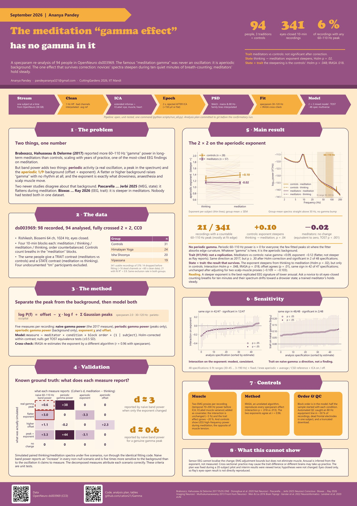

# Gamma(A re-analysis of OpenNeuro [ds003969])

Is the meditation gamma effect an oscillation or a broadband shift?

A re-analysis of OpenNeuro [ds003969](https://openneuro.org/datasets/ds003969) (Braboszcz,
Hahusseau & Delorme 2017; 98 participants, three meditation traditions plus controls,
eyes-closed meditation vs thinking) using spectral parameterisation (specparam / FOOOF) to
separate periodic and aperiodic components of the reported 60–110 Hz gamma increase, and to
test, in one dataset, whether the *state* (Jerbi lab, MEG) and *trait* (Ray lab, EEG) aperiodic
findings actually conflict.

Presented as a poster at CuttingGardens 2026, IIT Mandi (Ananya Pandey).

## Poster

[](docs/poster.pdf)

Click the image for the full-resolution A0 PDF.

## Pipeline

```
00_simulate      ground-truth validation (no data needed)
01_download      fetch task BDFs from OpenNeuro (~600 MB / subject)
02_preprocess    filter, bad channels, average ref, ICA + ICLabel, epochs, EMG proxies
03_spectra       Welch PSD per preprocessing variant, IRASA on the primary ROI
04_parameterize  specparam fits per ROI -> long table; optional multiverse and per-channel fits
05_stats         mixed 2x2 (meditator x condition), TOST, dose-response, EMG-confound, spec curve
06_figures       spectra, interaction plots, specification curves
07_stream        download -> process -> delete raw, per subject; replaces 01-03 with ~1 GB peak disk
08_report        write results/REPORT.md from whatever tables exist
```

## Setup (Windows, PowerShell)

```powershell
python -m venv .venv
.\.venv\Scripts\python -m pip install -e ".[dev]"
.\.venv\Scripts\python -m pytest
```

## Run

One command for everything (resumable; add `--overwrite` for a clean rerun of all 98):

```powershell
.\.venv\Scripts\python scripts\run_all.py
```

Stage by stage:

The recommended path is the **streaming stage**, which replaces 01–03 and needs ~1 GB of disk at
any time (each subject is downloaded, processed to ~4.5 MB of spectra, and its raw files deleted):

```powershell
.\.venv\Scripts\python scripts\00_simulate.py                       # validation, no data needed
.\.venv\Scripts\python scripts\07_stream.py --n-first 20 --n-jobs 4  # ~6 min per subject
.\.venv\Scripts\python scripts\04_parameterize.py --multiverse --channels
.\.venv\Scripts\python scripts\05_stats.py
.\.venv\Scripts\python scripts\06_figures.py
```

Omit `--n-first` for all 98 subjects (~10 h). The run is resumable.

Stages 01–03 remain for step-by-step work when you want to keep the raw files and the pre-ICA
epochs on disk (`01_download.py`, `02_preprocess.py --n-jobs 8`, `03_spectra.py --n-jobs 8`).

**Google Colab:** open [notebooks/colab_run.ipynb](notebooks/colab_run.ipynb). Outputs checkpoint
to Google Drive, so the run survives session limits; budget ~15 min per subject on the free tier.

Every script accepts `--config`, `--subjects`, `--n-first N`, `--overwrite`.
All analysis decisions live in [configs/default.yaml](configs/default.yaml); the
specification-curve grid in [configs/multiverse.yaml](configs/multiverse.yaml).

## Layout

```
brainmaxxing/   package: config, data, preprocess, spectra, parameterize, simulate, stats, plots
scripts/        numbered stages
configs/        YAML decisions
tests/          unit tests (run without data)
results/        tables/ (small CSVs, committed) and derivatives/ (large, ignored)
figures/        generated figures (figures/poster/ at print resolution)
```

## Data and storage

ds003969 is CC0 and not committed here; `01_download.py` fetches it to `dataset.bids_root`
in `configs/default.yaml`. **Keep `bids_root` and `derivatives` outside any cloud-synced folder**
(OneDrive, Dropbox): the raw data are ~58 GB and the derivatives ~30 GB, and sync clients lock and
re-upload every file as the pipeline writes it, which slowed this pipeline down by two orders of
magnitude. The defaults point to `C:/Users/offto/BrainMaxxingData/`; change them for your machine.

## Citation

Code: MIT. If you use this pipeline, cite the dataset (Braboszcz et al. 2017; OpenNeuro
ds003969) and specparam (Donoghue et al. 2020).
